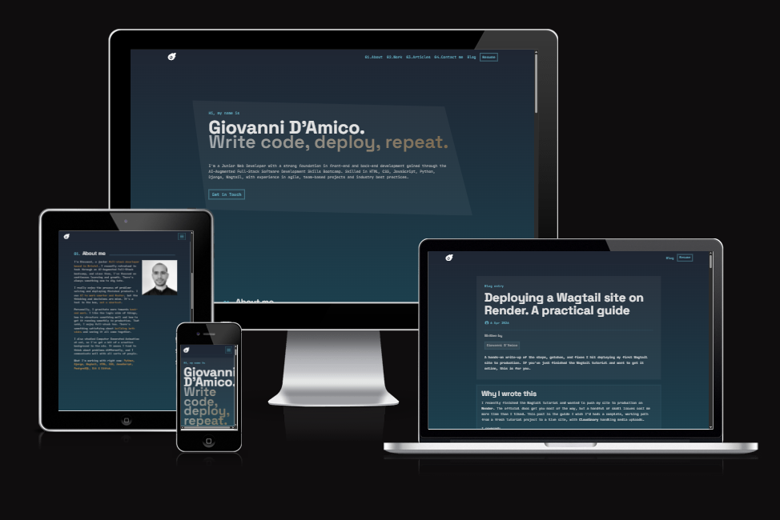
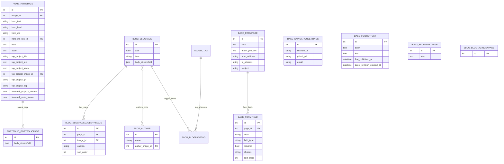

# Portfolio CMS (Wagtail)

A personal portfolio and blog CMS built with Wagtail and Django.

This project started from the official Wagtail beginner and extended tutorials, and was then expanded with custom homepage sections, content blocks, rich text editor extensions, and production-focused configuration.

4

## Table of Contents

- [Typography](#typography)
- [Colour Scheme](#colour-scheme)
- [Database Diagram](#database-diagram)
- [Features](#features)
- [Home page](#home-page)
- [Blog](#blog)
- [Navigation](#navigation)
- [Authentication & Authorisation](#authentication--authorisation)
- [Technologies Used](#technologies-used)
- [Libraries Used](#libraries-used)
- [Deployment](#deployment)

## Typography

This project uses a clear two-font system to balance personality and technical clarity.

- **Display / headings:** Space Grotesk (Google Fonts)
- **Body / utility text:** JetBrains Mono (Google Fonts)

## Colour Scheme

The visual identity is dark, modern, and editorial with cyan and amber accents.

### CSS variables

- `--text`: `#bebebe`
- `--background`: `#1f2633`
- `--primary`: `#6abdd2`
- `--secondary`: `#1c3f4d`
- `--accent`: `#d1944b`

### Usage pattern

- Primary color is used for links, navigation, button outlines, and section markers.
- Accent color is used for emphasis, stack labels, hover highlights, and custom rich text styling.
- The page uses a vertical background gradient from `--background` to `--secondary`.
- Layered glass-style UI is achieved through transparency and blur effects in navigation/cards.

## Database Diagram

## Features

### CMS and content architecture

- Wagtail-driven portfolio and blog CMS.
- Structured, editor-friendly content through StreamField and snippets.
- Homepage context automatically injects the latest published blog post.

### Custom blocks (complete list)

#### Base app blocks

- `CaptionedImageBlock`
- `HeadingBlock`
- `BaseStreamBlock`
  - `heading_block`
  - `paragraph_block`
  - `image_block`
  - `embed_block`

#### Blog app blocks

- `CodeBlock`
  - language selector: python, javascript, bash, html, css, json, sql
  - code text body

#### Home app blocks

- `ProjectCardBlock`
  - title
  - rich description
  - tech stack
  - repository link
  - deployed link (optional)

#### Portfolio app blocks

- `CardBlock`
- `FeaturedPostsBlock`
- `PortfolioStreamBlock` (extends `BaseStreamBlock` and adds portfolio-specific sections)

### Rich text editor custom features

- `rt_accent` inline style (accented text via `span.c-accent`).
- `colour-red` inline style (red emphasis via `span.rt-red`).

### Snippets, settings, and template tags

- `NavigationSettings` (LinkedIn, GitHub, Email) as site setting.
- `FooterText` as snippet with draft/revision/preview workflow.
- Template tags:
  - `get_footer_text`
  - `get_site_root`
  - `get_latest_cv_document`

## Home page

The homepage is a highly customized, section-based landing experience:

1. **Hero**
   - Intro copy, lead line, CTA label, CTA internal page link.
2. **About**
   - Rich text with custom accent style support.
   - Profile image panel.
3. **Top project**
   - Showcase card with image, description, stack list, GitHub and live links.
4. **Featured projects**
   - StreamField-driven grid using `ProjectCardBlock`.
5. **Featured articles**
   - Editor-selected blog posts + link to blog index.
6. **Contact area**
   - Social/email links from global settings.
   - Contact form page CTA.

## Blog

The blog subsystem includes:

- `BlogIndexPage` with reverse-chronological listing of live posts.
- `BlogPage` with date, intro, StreamField body, authors, and gallery images.
- `Author` snippet model with optional avatar.
- `BlogPageGalleryImage` orderable relationship per post.

Frontend blog templates provide:

- Rich blog listing cards with optional hero image per post.
- Author chips, image gallery on detail pages.
- Custom code block rendering through `blog/blocks/code_block.html`.

## Navigation

Navigation behavior is context-aware:

- Fixed, blurred top navbar.
- On homepage:
  - local anchor links (`About`, `Work`, `Articles`, `Contact me`)
  - plus in-menu child pages
- On non-home pages:
  - in-menu child pages only

Additional navigation utilities:

- Resume button auto-resolves the newest Wagtail document containing “CV” or “Resume” in its title.
- Footer renders social links from `NavigationSettings`.
- Footer text is dynamically pulled from the live `FooterText` snippet.

## Authentication & Authorisation

Current implementation relies on standard Django/Wagtail access control:

- Authentication: default Django + Wagtail admin login.
- Authorisation: role/permission management through Wagtail and Django admin groups.
- Public visitor access: controlled by Wagtail page publish state (`live`).

No custom public user registration, custom auth backend, or member-only gated frontend is currently implemented.

## Technologies Used

- Python
- Django 6.0.3
- Wagtail 7.3.1
- SQLite (development)
- PostgreSQL (production target)
- Bootstrap 5

## Libraries Used

### Core

- `wagtail`
- `Django`
- `django-modelcluster`
- `django-taggit`
- `django-filter`

### Deployment / infrastructure

- `whitenoise`
- `dj-database-url`
- `psycopg2-binary`
- `gunicorn`
- `django-cloudinary-storage`
- `cloudinary`

## Deployment

Deployment architecture in this project includes:

- Build pipeline through `build.sh` (`install`, `collectstatic`, `migrate`).
- Static asset handling via WhiteNoise compressed manifest storage.
- Cloudinary-backed media storage in production.
- Database URL configuration via `dj-database-url`.
- HTTPS redirect and trusted CSRF origin support in production settings.

For the complete deployment walkthrough, use your published article:

- **Deployment guide:** [Read the full deployment article](https://www.linkedin.com/pulse/deploying-wagtail-site-render-practical-guide-giovanni-d-amico-23nfe/)
